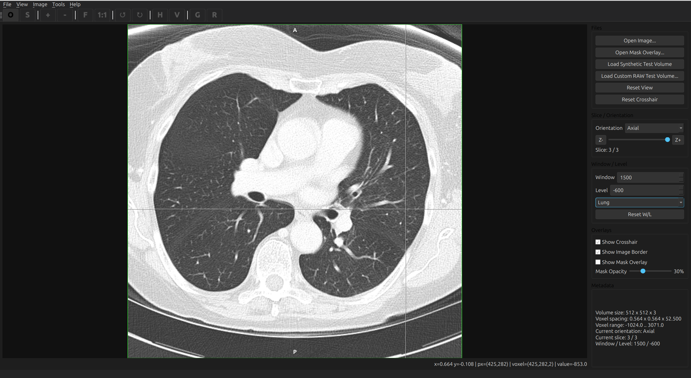
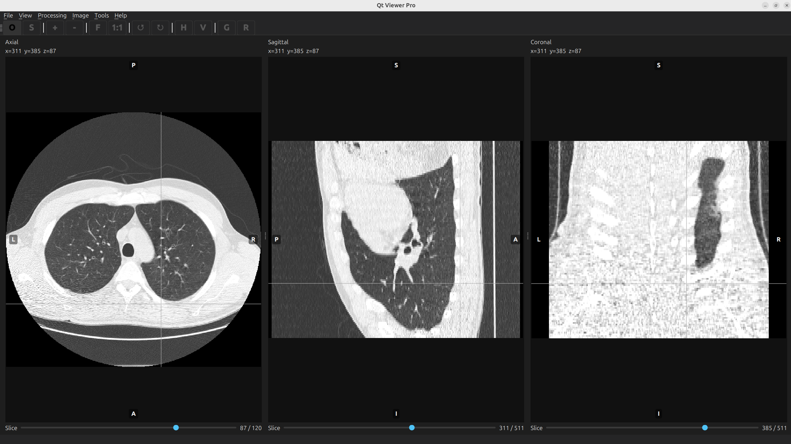
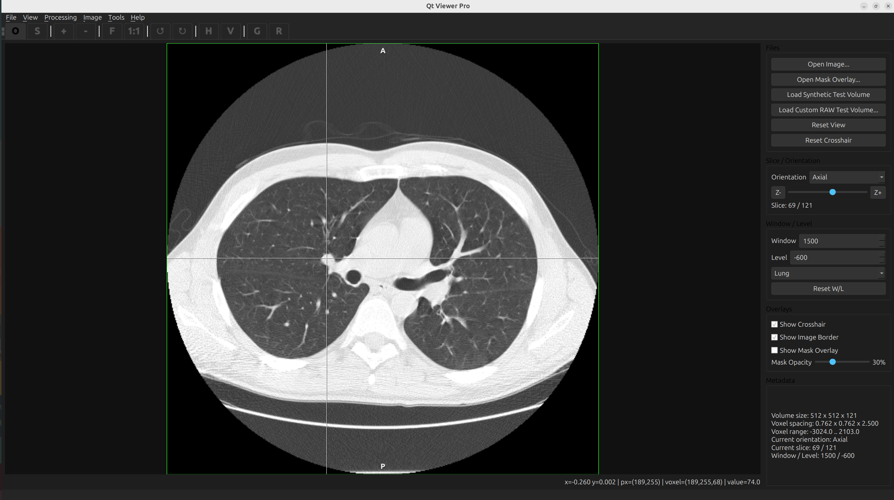
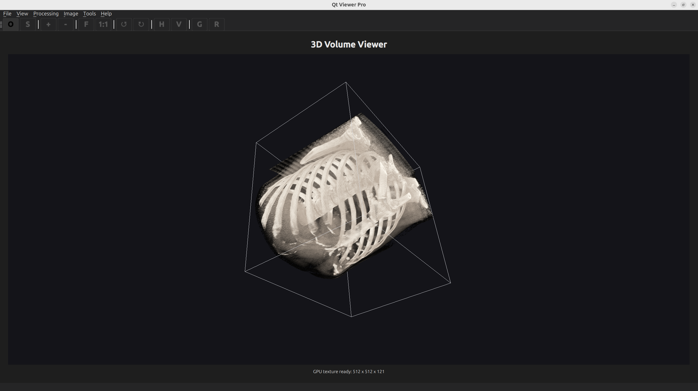
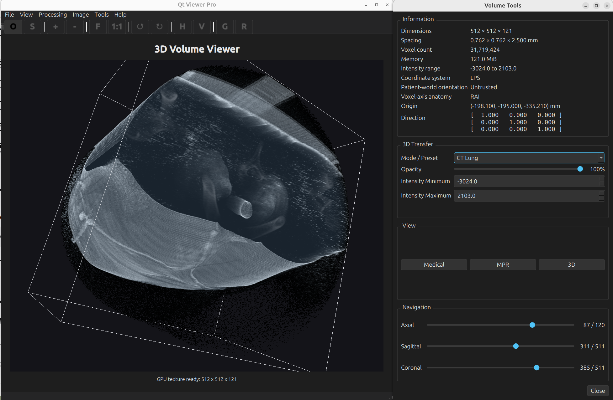
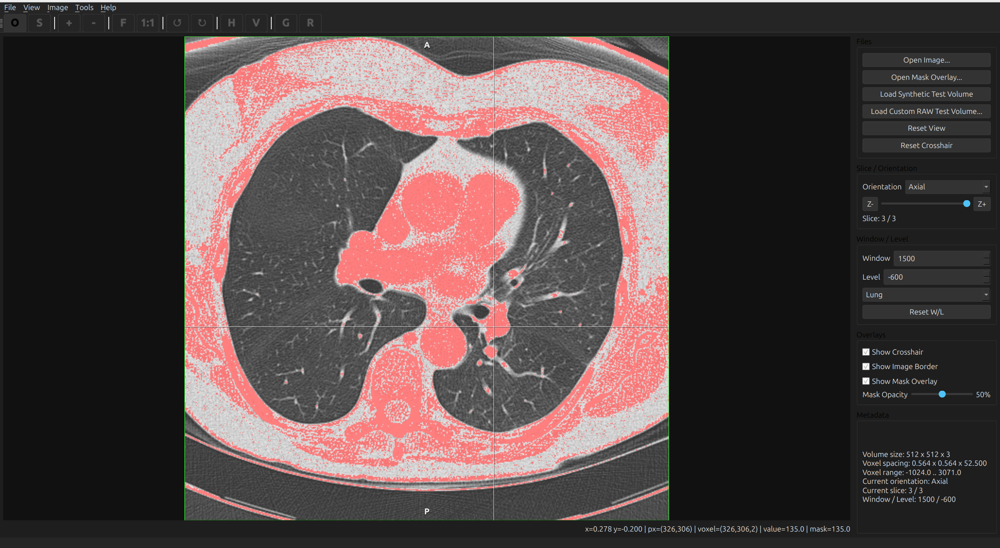
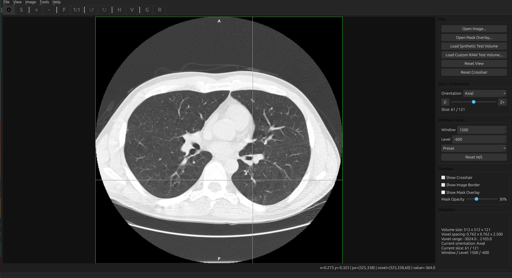

# Qt Viewer Pro

[](https://github.com/wpop/qt-viewer-pro/actions/workflows/ci.yml)

## Overview

Qt Viewer Pro is a C++20 / Qt 6 / OpenGL desktop medical imaging and volume visualization application. It combines general 2D image viewing with medical-volume loading, synchronized multi-planar reconstruction, coordinate-aware slice inspection, mask overlays, isotropic resampling, and interactive 3D volume rendering.

## Screenshots

### DICOM Series Viewer



Loads DICOM series for CT slice viewing with medical-volume navigation and visible dataset metadata.

### Synchronized MPR



Shows axial, sagittal, and coronal views with synchronized crosshairs and anatomical orientation labels.

### Medical Volume Viewer



Provides CT slice viewing with a crosshair, patient/world coordinates, and voxel plus volume metadata.

### 3D Volume Rendering



Displays OpenGL volume rendering with physical-spacing-aware rendering and medical render presets.

### Volume Tools



Combines volume information, synchronized navigation, and 3D transfer controls including opacity and manual intensity settings.

## Additional Views

### Mask Overlay



### NRRD Medical Volume



### 2D Grayscale Processing


## Features

- Common 2D image loading for PNG, JPG, JPEG, and BMP
- 2D zoom, pan, fit-to-window, actual-size viewing, drag and drop, and recent files
- Basic 2D image operations including rotate, flip, reset, and grayscale conversion
- Medical volume loading for DICOM series, NIfTI, MetaImage, NRRD, and custom float32 RAW volumes with JSON metadata
- Axial, sagittal, and coronal MPR with synchronized navigation across all panes
- MPR crosshairs driven by a shared voxel position
- Anatomical orientation edge labels for trusted orientation data
- Physical patient coordinates shown for the current voxel position when geometry is trusted
- Voxel spacing, intensity range, origin, direction, coordinate system, and related metadata display
- Mask overlay loading and opacity control for slice viewing
- Isotropic volume resampling to 1 mm spacing
- OpenGL 3D volume rendering with physical-spacing-aware scaling
- 3D render modes for Default, CT Bone, CT Lung, and Custom
- Manual 3D transfer controls for global opacity and intensity minimum / maximum
- Floating Volume Tools window for volume information, navigation, and 3D transfer controls

## Architecture

- `core` contains immutable data models and pure helpers such as `VolumeData`, anatomical orientation helpers, volume information formatting input, physical coordinate mapping, slice extraction, and MPR coordinate math.
- `io` contains image loading, the medical-volume loader registry, and format-specific loaders for DICOM, NIfTI, MetaImage, NRRD, and RAW workflows.
- `processing` contains resampling and image-processing utilities that operate on loaded data without owning UI state.
- `render` contains OpenGL rendering infrastructure, including the canonical 3D renderer and transfer-function state.
- `ui` contains `MainWindow`, the 2D viewer, the medical slice viewer, the synchronized MPR viewer, the 3D viewer wrapper, and the floating Volume Tools window.

Current ownership boundaries:

- `VolumeData` is shared across medical viewing surfaces with shared ownership.
- `MprViewerWidget` owns synchronized slice navigation and the shared current voxel position.
- `OpenGLVolumeRendererWidget` owns canonical 3D render and transfer-function state.
- `VolumeToolsWindow` is presentation and control UI only; it does not own canonical medical or render state.
- `MainWindow` coordinates page switching, actions, and signal wiring between components.

## Supported Formats

- 2D images: PNG, JPG, JPEG, BMP
- Medical volumes: DICOM series selected from one DICOM file, `.nii`, `.nii.gz`, `.mhd`, `.mha`, `.nrrd`, `.nhdr`
- Custom RAW volumes: float32 `.raw` data with JSON metadata selected through `File -> Open Medical Volume...`

## Basic Usage

### Open a DICOM Series

Use `File -> Open DICOM Series...`, select one DICOM file from the desired series, and the application discovers and loads the complete series from the same directory.

### Open a Medical Volume

Use `File -> Open Medical Volume...`.

Supported file inputs include:

- NIfTI: `.nii`, `.nii.gz`
- MetaImage: `.mhd`, `.mha`
- NRRD: `.nrrd`, `.nhdr`
- RAW JSON metadata: `.json`

For RAW JSON, select the JSON metadata file, the loader resolves the associated `.raw` data file, and no second file dialog is required.

### Open a Mask Overlay

Load a medical volume first, then use `File -> Open Mask Overlay...`.

## Build

Main dependencies:

- C++20 compiler
- CMake
- Ninja
- Qt 6
- OpenCV
- ITK

Build on Ubuntu/Linux with:

```bash
cmake -S . -B build -G Ninja
cmake --build build
```

## Run

```bash
./build/qt-viewer-pro
```

## Testing

```bash
ctest --test-dir build --output-on-failure
```

The current automated suite contains 17 tests covering:

- volume data and metadata
- anatomical orientation formatting
- physical coordinate mapping
- transfer-function logic
- slice extraction and slice image conversion
- MPR coordinate and orientation mapping
- window/level processing
- isotropic resampling
- NIfTI, MetaImage, NRRD, and RAW-oriented medical loader paths

## Project Status

v1.0.0 release candidate / feature-complete for the current viewer scope.

## License

MIT License.
